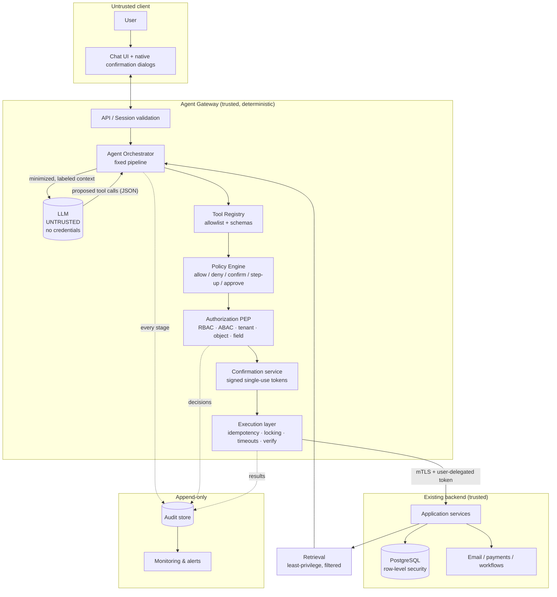

# 01 — Reference Architecture

## Design principle

The model plans; the platform decides and acts. Between the model and every system of record sits a deterministic **Agent Gateway** that owns validation, authorization, policy, confirmation, execution, and audit. The LLM is a stateless text-in/JSON-out component with no credentials, no network reach, and no memory of secrets.

## Components

| Component | Trust level | Responsibility |
|---|---|---|
| **Chat UI** | User-facing | Renders conversation, structured action previews, and confirmation dialogs (native UI elements, not chat text) |
| **API / Session layer** | Trusted | Authenticates the user, validates the session, attaches user/tenant identity to every request |
| **Agent Orchestrator** | Trusted (deterministic) | Runs the fixed execution pipeline; calls the LLM for interpretation/planning only; never lets the model skip a stage |
| **LLM (model provider)** | **Untrusted** | Interprets requests, proposes tool calls with parameters, drafts responses. Sees only minimized, labeled context |
| **Tool Registry** | Trusted | Compile-time allowlist of tool definitions: Zod input/output schemas, risk tier, handler. Unknown tool → hard reject |
| **Policy Engine (PDP)** | Trusted | Pure decision function: `allow / deny / require_confirmation / require_step_up_auth / require_approval` from user, tenant, role, action, resource, fields, sensitivity, record count, recipients, auth strength, confirmation status |
| **Authorization service (PEP)** | Trusted | Enforces RBAC/ABAC + tenant/object/row/field checks per tool call, at execution time, using the user's delegated token |
| **Confirmation service** | Trusted | Issues HMAC-signed, single-use, short-TTL tokens bound to the exact action hash; validates them on execution |
| **Execution layer** | Trusted | Idempotency, timeouts, optimistic locking, transactions, compensations, result verification |
| **Application services / APIs** | Trusted (existing) | The only path to data. Enforce their own authz again (defense in depth) |
| **Database** | Trusted | Postgres with row-level security per tenant; reachable only from application services |
| **Audit store** | Trusted, append-only | Immutable audit events for every stage; feeds monitoring/alerting |

## Trust boundaries

1. **Browser ↔ API** — untrusted client; authenticate + validate everything.
2. **Orchestrator ↔ LLM** — *the critical boundary.* Everything crossing outward is minimized/redacted (it may be retained by the provider and can be echoed back to the user); everything crossing inward (model output) is untrusted input to be schema-validated, never executed directly.
3. **Retrieved content ↔ model context** — records, documents, uploads, and emails enter the context as labeled untrusted data; they can never redefine instructions or permissions.
4. **Gateway ↔ application services** — service-to-service mTLS plus the user's short-lived delegated token; services re-authorize independently.
5. **Services ↔ database** — only services hold DB credentials; RLS enforces tenant isolation even against service bugs.

## Diagram



## Authentication & authorization flow

1. User signs in via the existing IdP (OIDC); session carries `user_id`, `tenant_id`, roles, auth strength (password / MFA / step-up), and expiry.
2. Each chat request re-validates the session. The gateway mints a **short-lived delegated token** (minutes, audience-restricted per tool call) representing "this user, this tenant, this action scope" — never a standing service credential.
3. For every proposed tool call: registry lookup → schema validation → policy decision → authorization check against the target object/rows/fields → (confirmation / step-up / approval if required) → execution with the delegated token → application service re-authorizes.
4. Authorization is evaluated **at execution time**, per call — never cached from planning time, never inferred from the conversation, never decided by the model.

## Tool-execution flow (the fixed pipeline)

```
interpret → plan (structured) → minimal retrieval → validate plan vs. policy
→ authorize user for each step → classify risk tier → confirm if required
→ execute via approved tool → verify result → audit → summarize to user
```

The model participates only in *interpret*, *plan*, and *summarize*. Stages cannot be skipped because the orchestrator is ordinary code: the only function that can invoke a tool handler is the executor, and it requires as arguments the schema-validated input, a fresh authorization decision, a policy decision, and (when required) a valid confirmation token. There is no code path from "model output" to "handler" that bypasses these — this is enforced by construction and by tests, not by prompt instructions.

## Data flow

- **Inbound to model:** user message + minimal, field-filtered, PII-masked retrieval results, each wrapped in an untrusted-data envelope with provenance labels. No secrets, no credentials, no full-table dumps.
- **Outbound from model:** JSON matching a response schema (either a user-facing message or a proposed tool call). Anything else is rejected.
- **To backend:** only typed tool inputs over authorized service calls.
- **To user:** rendered summaries plus structured previews; sensitive values masked per field-level permissions.

## Audit flow

Every stage emits an event (request, plan, retrieval, policy decision, authz decision, confirmation issued/consumed, execution attempt, backend result, final response) sharing one `correlation_id`. Events are append-only, hash-chained, redacted of sensitive values, and monitored for anomalies (denial spikes, injection markers, unusual retrieval volume). Full schema in doc 08.
